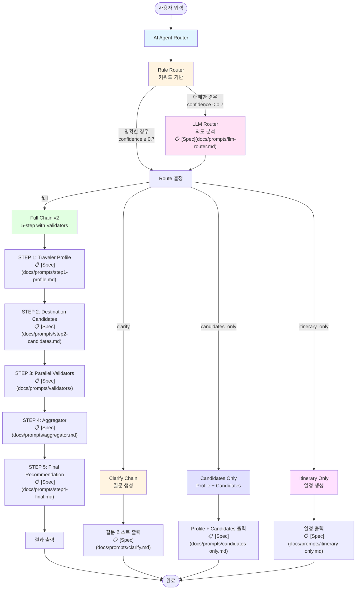
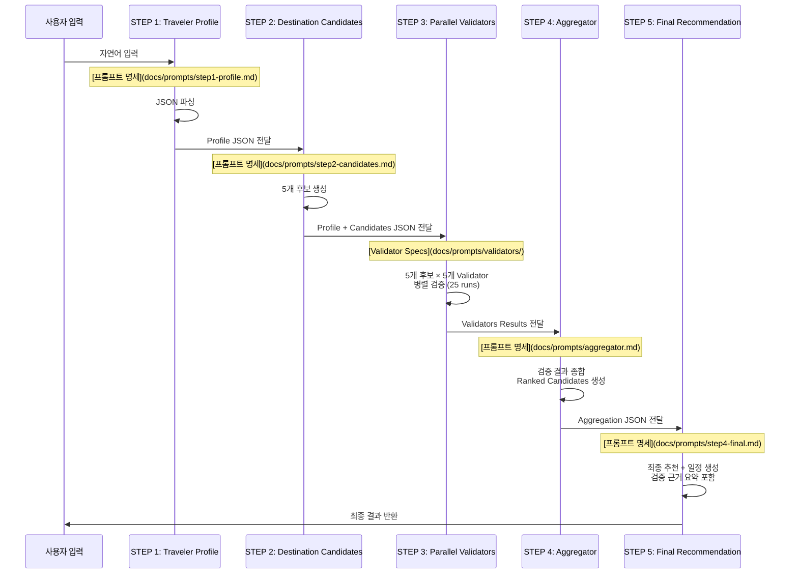

# Travel Guide MVP (Prompt Chaining)

이 프로젝트는 **Prompt Chaining 개념을 실제로 실습**하기 위한  
**Streamlit 기반 여행 추천 MVP**입니다.

하나의 질문으로 여행지를 추천하지 않고,  
**여러 단계의 사고(체인)를 거쳐 점진적으로 추천을 완성**하는 구조를 채택했습니다.

> 목적:  
> - 프롬프트 체이닝을 “개념”이 아니라 “제품 구조”로 이해하기  
> - FastAPI 없이도 LLM 기반 서비스 흐름을 빠르게 검증하기

## ✨ MVP Scope

현재 MVP는 아래 기능들을 포함합니다.

1. **AI Agent Router (의도 분기)**
   - 사용자 입력을 분석하여 적절한 실행 경로 선택
   - 하이브리드 라우팅: Rule Router + LLM Router
   - 4가지 라우트: `full`, `clarify`, `candidates_only`, `itinerary_only`
2. **여행 조건 입력**
   - 자연어 기반 입력 (예: 시기, 예산, 동행, 목적)
3. **체이닝 기반 여행 추천 결과 출력**
   - 단계별 중간 결과를 그대로 노출 (디버깅/학습 목적)
4. **Travel Concierge v2 (NEW)**
   - **병렬 검증(Parallel Validators)**: 5개 validator가 후보 도시를 병렬로 검증
     - `budget_fit`: 예산 적합성
     - `vibe_fit`: 취향 적합성
     - `transit_complexity`: 이동 난이도
     - `safety_risk`: 치안/안전성 (Web-Grounded 지원)
     - `seasonality_weather`: 계절/날씨 적합성 (Web-Grounded 지원)
   - **Aggregator**: 검증 결과를 종합하여 최종 추천 도출
   - **검증 근거 포함**: 최종 추천에 검증 근거 요약 포함
5. **Web-Grounded Validators (NEW)**
   - **Google CSE 기반 검색**: 신뢰 도메인에서 실제 정보 수집
   - **지원 Validators**: `safety_risk`, `seasonality_weather`
   - **Citations 포함**: 검색 출처를 결과에 포함
   - **자동 Fallback**: CSE 미설정 시 LLM-only로 자동 전환
   - 설정 가이드: [📋 Google CSE 설정 가이드](docs/GOOGLE_CSE_SETUP.md)

## 🧠 AI Agent Router + Prompt Chaining Structure

### 전체 아키텍처 시각화



### Router (의도 분기)

사용자 입력을 분석하여 적절한 실행 경로를 선택합니다:

- **Rule Router**: 키워드 기반 빠른 분기 (비용 0)
- **LLM Router**: 애매한 경우에만 호출 (confidence < 0.7)

### 4가지 라우트

1. **`full`**: 전체 5-step 체인 실행 (v2: Validators 포함)
2. **`clarify`**: 조건 부족 시 질문 생성
3. **`candidates_only`**: 후보 도시만 반환 (Profile + Candidates)
4. **`itinerary_only`**: 특정 목적지 기반 일정만 생성

### Full Chain v2 상세 구조 (5단계)

`full` 라우트 선택 시 아래 **고정된 5단계 체인**으로 수행됩니다 (Travel Concierge v2):



**단계별 상세 및 프롬프트 명세**:

| Step | 설명 | 프롬프트 명세 |
|------|------|--------------|
| **STEP 1** | Traveler Profile | [📋 상세 명세](docs/prompts/step1-profile.md) |
| **STEP 2** | Destination Candidates (5) | [📋 상세 명세](docs/prompts/step2-candidates.md) |
| **STEP 3** | Parallel Validators (NEW) | [📋 Validator 명세](docs/prompts/validators/) |
| **STEP 4** | Aggregator (NEW) | [📋 상세 명세](docs/prompts/aggregator.md) |
| **STEP 5** | Final Recommendation + Itinerary | [📋 상세 명세](docs/prompts/step4-final.md) |

**Validator 프롬프트 명세**:

| Validator | 설명 | 프롬프트 명세 |
|-----------|------|--------------|
| **Budget Fit** | 예산 적합성 검증 | [📋 상세 명세](docs/prompts/validators/budget-fit.md) |
| **Vibe Fit** | 취향 적합성 검증 | [📋 상세 명세](docs/prompts/validators/vibe-fit.md) |
| **Transit Complexity** | 이동 난이도 검증 | [📋 상세 명세](docs/prompts/validators/transit-complexity.md) |
| **Safety Risk** | 치안/안전성 검증 (Web-Grounded 지원) | [📋 상세 명세](docs/prompts/validators/safety-risk.md) |
| **Seasonality & Weather** | 계절/날씨 적합성 검증 (Web-Grounded 지원) | [📋 상세 명세](docs/prompts/validators/seasonality-weather.md) |

**Router 프롬프트 명세**:

| Router | 설명 | 프롬프트 명세 |
|--------|------|--------------|
| **LLM Router** | 의도 분석 및 라우트 결정 | [📋 상세 명세](docs/prompts/llm-router.md) |

**기타 체인 프롬프트 명세**:

| Chain | 설명 | 프롬프트 명세 |
|-------|------|--------------|
| **Candidates Only** | Profile + Candidates만 실행 | [📋 상세 명세](docs/prompts/candidates-only.md) |
| **Clarify** | 조건 확인 질문 생성 | [📋 상세 명세](docs/prompts/clarify.md) |
| **Itinerary Only** | 일정만 생성 | [📋 상세 명세](docs/prompts/itinerary-only.md) |

### 핵심 설계 원칙
- **Router가 사용자 의도에 따라 실행 경로 선택**
- **단계 구조는 고정**
- **각 단계 출력은 JSON으로 고정**
- **다음 단계는 이전 단계 JSON을 그대로 입력으로 사용**
- 추천은 **마지막 단계에서만 수행**

## 🧩 Tech Stack (Lean Stack - Option A)

- **Frontend**: Streamlit
- **LLM**: OpenAI (via LangChain)
- **Prompt Orchestration**: LangChain (Chain + PromptTemplate)
- **Observability (Optional)**: LangSmith
- **Backend API**: ❌ 없음 (Streamlit 단독)
- **Deployment**: Docker + GCP Cloud Run

## 📁 Project Structure

```
travel-guide-mvp/
├─ streamlit_app.py      # Streamlit app + Router + Chain orchestration
├─ requirements.txt      # Python dependencies
├─ Dockerfile            # Cloud Run deployment
├─ router/               # AI Agent Router
│  ├─ __init__.py
│  ├─ types.py          # RouteDecision, RouteResult models
│  ├─ rules.py          # Rule-based router
│  └─ llm_router.py     # LLM-based router (fallback)
├─ chains/              # Execution chains
│  ├─ __init__.py
│  ├─ full_chain.py     # Full chain (v1: 4-step, v2: 5-step)
│  ├─ parallel_validators.py # Parallel validators execution
│  ├─ aggregator.py     # Aggregator for validator results
│  ├─ clarify.py        # Clarify chain (questions)
│  ├─ candidates_only.py # Candidates only chain
│  ├─ itinerary_only.py # Itinerary only chain
│  └─ validators/       # Validator chains
│     ├─ __init__.py
│     ├─ budget_fit.py
│     ├─ vibe_fit.py
│     ├─ transit_complexity.py
│     ├─ safety_risk.py
│     ├─ safety_risk_web.py  # Web-grounded safety validator
│     ├─ seasonality_weather.py
│     └─ seasonality_weather_web.py  # Web-grounded weather validator
├─ tools/               # External tools
│  ├─ __init__.py
│  └─ google_cse.py     # Google Custom Search Engine client
├─ observability/        # LangSmith integration
│  ├─ __init__.py
│  └─ langsmith.py      # Tracing helpers
└─ .streamlit/
   └─ secrets.toml      # (로컬 전용) API Key
```

## 🚀 Getting Started (Local)

### 1. Environment Variable 설정

#### 필수: OpenAI API Key

```bash
export OPENAI_API_KEY="YOUR_OPENAI_API_KEY"
````

또는 `.streamlit/secrets.toml`:

```toml
OPENAI_API_KEY="YOUR_OPENAI_API_KEY"
```

#### 선택: Google CSE (Web-Grounded 기능 사용 시)

Web-Grounded Validator를 사용하려면 Google Custom Search Engine 설정이 필요합니다.

**상세 설정 가이드**: [📋 Google CSE 설정 가이드](docs/GOOGLE_CSE_SETUP.md)

간단 요약:
```toml
GOOGLE_CSE_API_KEY="your_api_key"
GOOGLE_CSE_CX_WEATHER="your_weather_pse_id"
GOOGLE_CSE_CX_SAFETY="your_safety_pse_id"  # 선택
```

> **참고**: Google CSE가 설정되지 않아도 앱은 정상 작동합니다.  
> 이 경우 LLM-only validator로 자동 fallback됩니다.

### 2. Install & Run

```bash
pip install -r requirements.txt
streamlit run streamlit_app.py
```

브라우저에서:

```
http://localhost:8501
```

## 🖥️ Usage

### 라우트별 입력 예시

#### Full Route (전체 추천)
```
3월에 혼자 4일 정도 여행,
예산은 150만원,
걷기와 카페 위주,
조용한 휴식 선호,
해외 여행
```
→ 전체 5-step 체인 실행 (v2: Validators 포함)

#### Clarify Route (조건 확인)
```
여행 가고 싶어요
```
→ 조건 부족 감지, 질문 생성

#### Candidates Only Route (후보만)
```
3월에 혼자 4일, 예산 150만원, 여행지 후보만 알려줘
```
→ Profile + Candidates까지만 실행

#### Itinerary Only Route (일정만)
```
도쿄 3박4일 일정 알려줘
```
→ 목적지 기반 일정만 생성

### 출력 구성

**Full Route 선택 시 (v2):**
* STEP 1: 여행자 성향 요약(JSON)
* STEP 2: 추천 후보 도시 5곳
* STEP 3: 병렬 검증 결과 (5개 Validator × 5개 후보 = 25개 검증)
* STEP 4: 검증 결과 종합 (Ranked Candidates + Final Choice)
* STEP 5: 최종 추천 + 3박 4일 일정 + 검증 근거 요약

**다른 라우트 선택 시:**
* 각 라우트에 맞는 최적화된 결과만 출력

모든 결과는 **Streamlit expander**로 단계별 확인 가능.

## 🧪 실습 포인트

이 프로젝트는 **학습용 MVP**이므로 다음을 직접 실험해보는 것을 권장합니다.

* `temperature` 값 조절 → 결과 안정성 vs 다양성 비교
* 후보 생성 기준 수정 → 추천 품질 변화 관찰
* JSON Schema 변경 → 체이닝 안정성 체감
* Step 하나 제거/추가 → UX 변화 확인

## 🔍 Observability (LangSmith)

프롬프트/체인 실행 로그를 LangSmith에서 추적하고 모니터링할 수 있습니다.

### 로컬 개발

`.streamlit/secrets.toml` 파일에 다음을 추가하세요:

```toml
LANGSMITH_TRACING="true"
LANGSMITH_ENDPOINT="https://api.smith.langchain.com"
LANGSMITH_API_KEY="YOUR_LANGSMITH_API_KEY"
LANGSMITH_PROJECT="travel-guide"
```

또는 환경변수로 설정:

```bash
export LANGSMITH_TRACING=true
export LANGSMITH_ENDPOINT=https://api.smith.langchain.com
export LANGSMITH_API_KEY="YOUR_LANGSMITH_API_KEY"
export LANGSMITH_PROJECT="travel-guide"
```

### LangSmith 대시보드

설정 후 앱을 실행하면 LangSmith 대시보드에서 다음을 확인할 수 있습니다:
- **통합 추적 구조**: Router → 선택된 Chain이 하나의 통합된 추적으로 표시
- 각 프롬프트 체인 단계별 실행 시간
- LLM 호출 비용 및 토큰 사용량
- 체인 실행 추적 및 디버깅 정보
- Route 태그로 필터링 가능 (`route:full`, `route:clarify` 등)
- 에러 및 예외 로그

**추적 구조:**
```
travel_guide_router_chain (통합 추적)
  ├─ Rule Router / LLM Router
  └─ Selected Chain
      ├─ Full Chain v2 (5-step with Validators) 또는
      ├─ Clarify Chain 또는
      ├─ Candidates Only Chain 또는
      └─ Itinerary Only Chain

Full Chain v2 내부:
  ├─ STEP 1: Profile
  ├─ STEP 2: Candidates
  ├─ STEP 3: Parallel Validators (25 runs 병렬)
  ├─ STEP 4: Aggregator
  └─ STEP 5: Final Recommendation
```

**LangSmith 태그:**
- `route:full`, `route:clarify`, `route:candidates_only`, `route:itinerary_only`
- `flow:concierge_v2` (Full route v2 실행 시)
- `flow:concierge_v2_web` (Web-grounded validators 사용 시)
- `validator:budget_fit`, `validator:vibe_fit` 등 (각 validator별)

LangSmith 대시보드: https://smith.langchain.com

## 🐳 Deployment (GCP Cloud Run)

### Docker Build

```bash
docker build -t travel-guide-mvp .
```

### Run (Local Docker)

```bash
docker run -p 8080:8080 \
  -e OPENAI_API_KEY=YOUR_OPENAI_API_KEY \
  travel-guide-mvp
```

Cloud Run에서는:

* 컨테이너 이미지 지정
* 환경변수에 `OPENAI_API_KEY` 설정
* 포트: `8080`

## 🔮 Next Steps (Out of MVP)

이 MVP는 이후 아래 방향으로 자연스럽게 확장 가능합니다.

* FastAPI 분리 (API / UI 분리)
* 추천 결과 저장 (Capsule)
* Vector DB(Qdrant) 기반 검색
* 사용자 기록(Entries) + RAG
* Supabase Auth 연동
* 비용 최적화 (단계별 모델 분리)

## 🧭 Philosophy

> **프롬프트는 명령어가 아니라,
> 사고를 유도하는 구조다.**

이 프로젝트는
“LLM에게 무엇을 시킬까?” 보다
“어떤 사고 순서를 밟게 할까?”를 고민하는 실험입니다.

## 📄 License

MIT (또는 개인 실습용)

## 👤 Author

Hosung AI Lean Stack
(프롬프트 체이닝 & MVP 실험 프로젝트)
