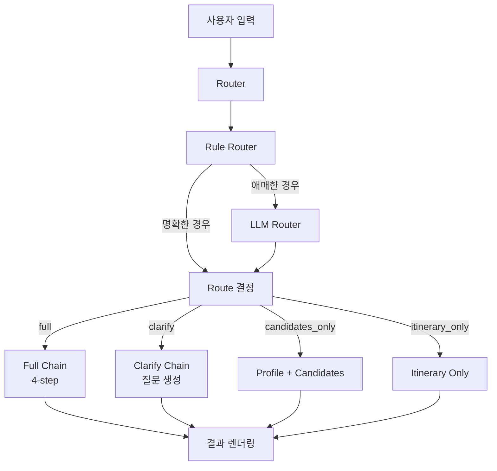

# AI Agent Router 구현 계획

## 개요

현재 `streamlit_app.py`의 4-step 통합 체인(`build_unified_chain()`)을 유지하면서, 라우터를 앞단에 추가하여 사용자 입력 의도에 따라 다른 체인을 실행하도록 합니다.

## 아키텍처



## 구현 단계

### Phase 0: 베이스라인 정리 및 구조 준비

**파일**: [streamlit_app.py](streamlit_app.py)

1. 현재 `run_chain()` 함수를 `chains/full_chain.py`로 분리

   - `build_unified_chain()` 함수를 모듈로 이동
   - `safe_json()` 헬퍼 함수도 함께 이동

2. 결과 payload 표준화

   - 모든 체인 결과를 `{"route": str, "router_reason": str, "data": dict}` 형태로 래핑
   - `RouteResult` Pydantic 모델 정의

**새 파일**:

- `chains/__init__.py`
- `chains/full_chain.py` - 기존 통합 체인 이동
- `router/__init__.py`
- `router/types.py` - `RouteDecision`, `RouteResult` 모델 정의

### Phase 1: Rule Router 구현

**파일**: [router/rules.py](router/rules.py) (신규)

1. 키워드 기반 라우팅 규칙 구현

   - 조건 부족 감지: 기간/예산/동행/목적 중 2개 이하 → `clarify`
   - "후보만", "여행지 후보" 키워드 → `candidates_only`
   - "일정", "코스", "3박4일" + 장소 힌트 → `itinerary_only`
   - 그 외 → `full`

2. `RouteDecision` 반환

   - `route`: 선택된 라우트
   - `reason`: 선택 이유
   - `confidence`: 신뢰도 (0.0~1.0)
   - `missing_fields`: 부족한 필드 목록

**통합**: [streamlit_app.py](streamlit_app.py)에서 Rule Router 호출 후 분기 처리

### Phase 2: LLM Router 추가

**파일**: [router/llm_router.py](router/llm_router.py) (신규)

1. LLM 기반 라우팅 구현

   - Rule Router에서 `route=None` 또는 `confidence < 0.7`인 경우만 호출
   - JSON 스키마 고정: `{"route": str, "reason": str, "missing_fields": list, "confidence": float}`
   - 모델: `gpt-4o-mini`, temperature: 0.2

2. Fallback 처리

   - LLM Router 실패 시 `clarify`로 fallback
   - JSON 파싱 실패 시 1회 재시도

**통합**: Rule Router와 연동하여 하이브리드 라우팅 완성

### Phase 3: Route별 체인 구현

**파일**:

- [chains/clarify.py](chains/clarify.py) (신규)
- [chains/itinerary_only.py](chains/itinerary_only.py) (신규)
- [chains/full_chain.py](chains/full_chain.py) - 기존 체인 이동

1. Clarify Chain

   - 질문 3~5개 생성 프롬프트
   - 추천 금지, 조건 보완 질문만 생성

2. Itinerary Only Chain

   - 사용자 입력에서 목적지 추출
   - 목적지 기반 일정만 생성 (profile/candidates 생략)

3. Candidates Only

   - 기존 `profile_chain` + `candidates_chain`만 실행
   - comparison/final 단계 생략

**UI 업데이트**: [streamlit_app.py](streamlit_app.py)

- route별 결과 렌더링 분기
- 실행된 route 표시 (상단 배지)

### Phase 4: LangSmith 시각화 강화

**파일**: [observability/langsmith.py](observability/langsmith.py) (신규)

1. Metadata/Tags 기록

   - Router 실행 시 `route:<route_name>`, `router:rule|llm` 태그 추가
   - `request_id` 생성 및 기록

2. Runnable 분리

   - Router를 별도 RunnableLambda로 분리하여 트리 구조 명확화
   - 각 체인도 독립적인 Runnable로 구성

**통합**: 모든 체인 실행 시 LangSmith 태그 자동 기록

### Phase 5: 품질/안정성 개선 (선택)

1. JSON 파싱 재시도 로직

   - Router 출력, 체인 출력에 대해 1회 repair 재시도

2. 에러 핸들링

   - Route별 표준화된 에러 메시지
   - Timeout 처리

3. 캐시 (선택)

   - 동일 입력에 대한 route 결정 캐시 (메모리, 10분 TTL)

## 파일 구조

```
travel-guide-mvp/
├── streamlit_app.py          # 메인 앱, Router 통합
├── router/
│   ├── __init__.py
│   ├── types.py              # RouteDecision, RouteResult
│   ├── rules.py              # Rule Router
│   └── llm_router.py         # LLM Router
├── chains/
│   ├── __init__.py
│   ├── full_chain.py         # 기존 4-step 체인
│   ├── clarify.py            # Clarify 체인
│   └── itinerary_only.py     # Itinerary Only 체인
├── observability/
│   ├── __init__.py
│   └── langsmith.py          # LangSmith 태그/메타데이터 헬퍼
└── tests/
    └── routing_cases.py      # 라우팅 테스트 케이스
```

## 주요 변경 파일

- [streamlit_app.py](streamlit_app.py): Router 통합, route별 UI 분기
- [chains/full_chain.py](chains/full_chain.py): 기존 체인 모듈화
- [router/rules.py](router/rules.py): Rule Router 구현
- [router/llm_router.py](router/llm_router.py): LLM Router 구현
- [chains/clarify.py](chains/clarify.py): Clarify 체인
- [chains/itinerary_only.py](chains/itinerary_only.py): Itinerary Only 체인
- [observability/langsmith.py](observability/langsmith.py): LangSmith 헬퍼

## 검증 기준

1. 4개 라우트로 안정적으로 분기
2. `itinerary_only` 선택 시 profile/candidates 체인 미실행
3. LangSmith에서 Router → 선택된 체인 트리 구조 확인 가능
4. route 태그로 필터링 가능
5. 라우팅 케이스 10개 기준 80% 이상 적중률